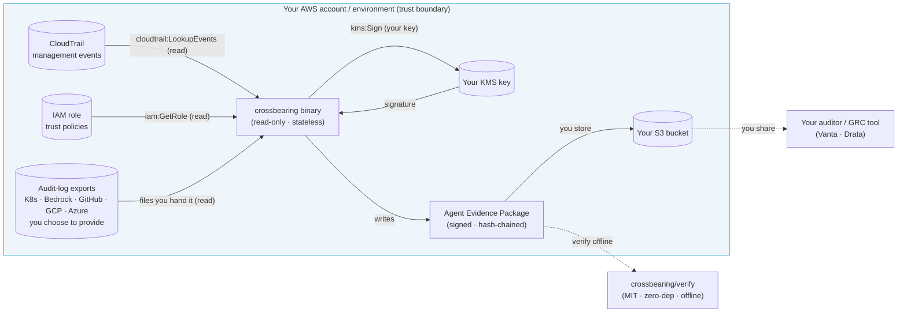

# Data flow & trust boundaries

The security-review version of "what touches what." The one fact that governs the
rest: **everything happens inside your account, and no customer data crosses a
boundary to crossbearing.**

## What this shows

- **Inputs are reads, inside your account.** CloudTrail and IAM trust policies via
  the [read-only role](../../deploy/readonly-role/); any other audit logs are files
  *you* export and hand over. No inbound access to your data is opened to a vendor.
- **The join runs locally.** Correlating claims against records happens in the
  binary's process — in your account or on your operator's machine. No data is sent
  out to be processed.
- **Output stays yours.** The evidence package is signed with **your** KMS key and
  written to **your** storage. Crossbearing never holds the package or the key.
- **No vendor boundary is crossed by data.** There is no crossbearing backend, API,
  or datastore in this diagram — because there isn't one. The only crossbearing-side
  artifact is the binary itself.
- **Trust is transferable.** Your auditor verifies the package with the separate,
  MIT-licensed, zero-dependency verifier — confirming the chain and signature
  **without trusting crossbearing's build or remaining a crossbearing customer.**

## The boundaries, named

| Boundary | Crosses it | Direction | Protection |
|---|---|---|---|
| Your account ⇄ AWS APIs | LookupEvents / GetRole / Sign | read (+ sign) | TLS; least-privilege role; external id |
| crossbearing binary ⇄ your data | nothing leaves | — | read-only by architecture; stateless |
| You ⇄ auditor | the evidence package *you* choose to share | outbound, your control | your decision; package is signed + verifiable |

See the [threat model](../threat-model.md) for the STRIDE analysis per boundary.
